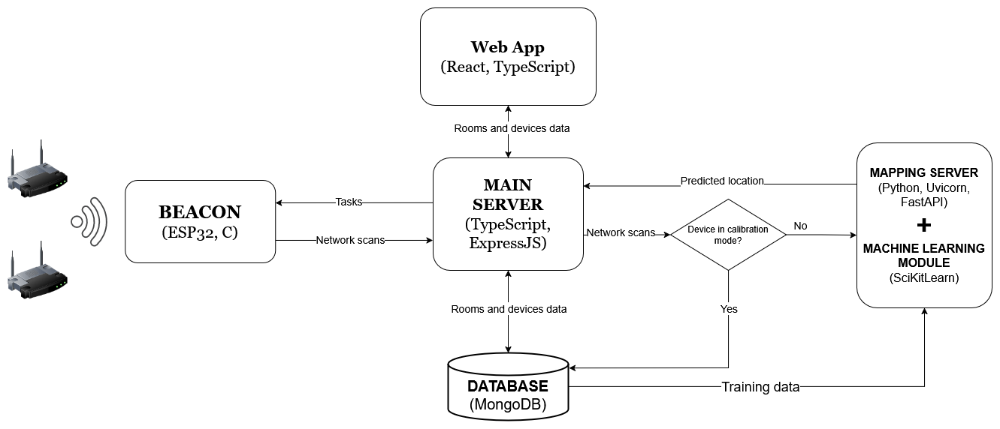

# What is BeaconBlink?
BeaconBlink is a system of mobile devices capable of indoor localization using WiFi network. It was developed as a part of Computer Science Engineering Degree at AGH University of Science and Technology in Kraków, Poland.

## Main Features

### Web Application
- Configure and maintain the entire localization system through an intuitive admin dashboard
- Send messages to specific devices
- Visualize devices on an interactive map with real-time position updates
- Filter and organize rooms using customizable tags for efficient management

### Mobile Devices
- Display location data with up to 5-meter accuracy on integrated LCD screen
- Monitor connection status and battery levels at a glance
- Receive and display administrator messages with notifications

## System architecture

The system is built on the following modular components:

- **Beacon Devices**: ESP32-based mobile hardware units equipped with WiFi capabilities that broadcast and receive signals for position tracking. [View Repository](https://github.com/BeaconBlink/Pager)
- **Server Deployment**: Server based infrastracture along with the database, containarized with Docker [View Repository](https://github.com/BeaconBlink/Deployment)
  - **Main server and web application**: NodeJS main server responsible for orchestrating data flow between components, along with Web Application for the user [View Repository](https://github.com/BeaconBlink/Server)
  - **Mapping" server running alongside a machine learning module**: Python server responsible for communication between the SciKitLearn Machine Learning Module and other components [View Repository](https://github.com/BeaconBlink/Room_mapping)

Each module communicates through RESTful APIs.

For detailed information on any specific module, please visit its respective repository through the links above.

## Team
 - ### [Dawid Kardacz](https://github.com/kardam00n)
 - ### [M. Bartczak](https://github.com/VeryLongNicknameSuchWow)
 - ### [Andrzej Zaborniak](https://github.com/Kappaprideer)

